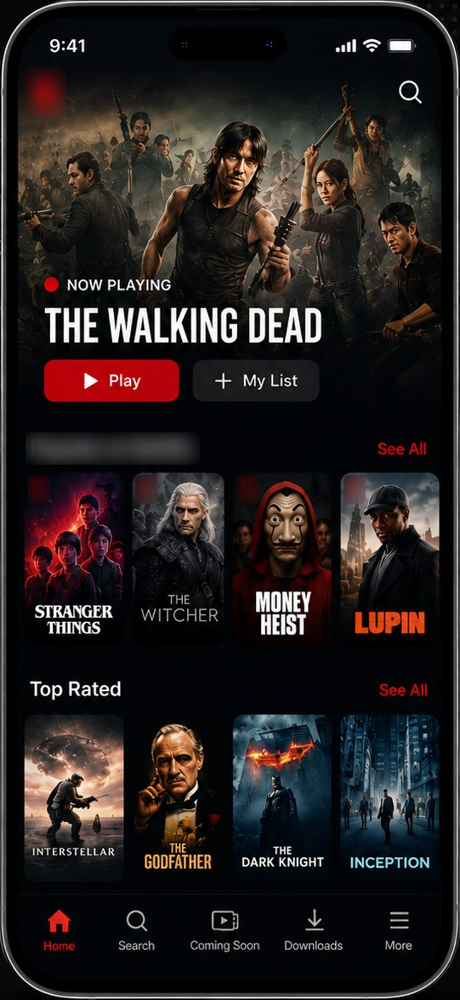
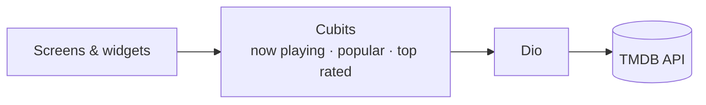

# Streaming App

A streaming-style movie app built with Flutter. It shows live movie lists from The Movie Database (TMDB) in a dark, streaming-service style interface.

<p align="center">
  
  <br/>
  <sub>Home screen (from the project's promotional mockup)</sub>
</p>

## Features

- **Now Playing** — featured movies from TMDB.
- **Popular** and **Top Rated** — horizontal movie lists from TMDB.
- **Movie details** — a detail page for each movie.
- Animated splash screen (Lottie) and bottom navigation.
- Search, Coming Soon, Downloads and More tabs are interface screens and are **not connected to data yet** — search does not return results.

## Tech Stack

| | |
|---|---|
| Framework | Flutter · Dart |
| State management | Cubit (`flutter_bloc`) — one Cubit per movie list |
| Networking | Dio · TMDB REST API |
| UI | carousel_slider · Lottie · flutter_svg · flutter_animate · readmore |

## Architecture



```
lib/
├── core/           # API URLs, constants, colors, text styles
├── data/           # movie models
├── logic/          # now_playing, popular and top_rated Cubits
└── presentation/   # screens and widgets
```

## Getting Started

Requirements: Flutter with Dart SDK `^3.8.0` and a free TMDB API key ([themoviedb.org](https://www.themoviedb.org/settings/api)).

```bash
git clone https://github.com/esllamesso/Movie-App.git
cd Movie-App
flutter pub get
flutter run --dart-define=TMDB_API_KEY=your_key_here
```

The key is read at build time with `String.fromEnvironment('TMDB_API_KEY')` and is never stored in the repository. Use the same flag for release builds, e.g. `flutter build apk --dart-define=TMDB_API_KEY=your_key_here`. Without it, the movie lists will not load.

## Disclaimer

This product uses the TMDB API but is not endorsed or certified by TMDB. It is a personal UI project; the Netflix-style branding is used for learning and portfolio purposes only, and the app is not affiliated with or endorsed by Netflix. Movie titles, artwork and trademarks belong to their respective owners.

## Author

**Islam Mohamed Hassan** — Flutter Developer · AI & Digital Marketing Specialist · Flutter Instructor
[Portfolio](https://eso-portfolio-psi.vercel.app) · [LinkedIn](https://www.linkedin.com/in/eslam-mohamed-9ba442297/) · [GitHub](https://github.com/esllamesso)

---

© Islam Mohamed Hassan. All rights reserved. This repository is shared for portfolio purposes; no open-source license is granted.
